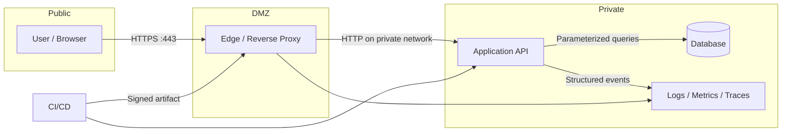

# I Am the One Who Knocks

An end-to-end, hands-on networking and application-security study monorepo. It connects packet-level fundamentals to secure application design, threat modeling, testing, observability, and incident response.

> Use the labs only on systems you own or have explicit permission to test. The local lab binds only to `127.0.0.1` by default.

## What you will learn

- How traffic moves through OSI/TCP-IP layers, switching, routing, DNS, TCP, TLS, HTTP, proxies, and containers.
- How to design and reason about a small production-style web system.
- How to apply security controls across requirements, implementation, CI/CD, runtime, and incident response.
- How SAST, DAST, and VAPT differ, complement one another, and fit into delivery.
- How automated security gates and broader cyber defenses connect code to production.
- How to validate assumptions with repeatable local labs and evidence.

## Repository map

```text
.
|-- docs/
|   |-- architecture/       # HLD, LLD, request flows, trust boundaries
|   |-- appsec/             # threat model, secure SDLC, testing, checklist
|   |-- networking/         # foundations and protocol study notes
|   |-- operations/         # observability and incident runbooks
|   `-- study-plan.md       # 12-week guided path
|-- labs/
|   `-- reverse-proxy/      # safe localhost-only Nginx + API lab
|-- scripts/                # repository validation
|-- CONTRIBUTING.md
|-- SECURITY.md
`-- LICENSE
```

## Quick start

Prerequisites: Git, Docker Desktop (or Docker Engine with Compose), and PowerShell 7+ or Bash.

```bash
git clone https://github.com/biswajitNanda223/i-am-the-one-who-knocks.git
cd i-am-the-one-who-knocks
docker compose -f labs/reverse-proxy/compose.yaml up --build -d
curl http://127.0.0.1:8080/health
curl http://127.0.0.1:8080/api/request-info
docker compose -f labs/reverse-proxy/compose.yaml down
```

On PowerShell, validate the repository (the explicit bypass is useful on machines with a restrictive local script policy):

```powershell
powershell -NoProfile -ExecutionPolicy Bypass -File ./scripts/validate.ps1
```

## Recommended learning path

1. Read the [12-week study plan](docs/study-plan.md).
2. Build the network mental model in [networking fundamentals](docs/networking/01-fundamentals.md).
3. Trace a browser request with [DNS, TCP, TLS, and HTTP](docs/networking/02-request-lifecycle.md).
4. Review the [system architecture](docs/architecture/README.md) and [LLD](docs/architecture/lld.md).
5. Run the [reverse-proxy lab](labs/reverse-proxy/README.md).
6. Apply the [threat model](docs/appsec/threat-model.md) and [security test plan](docs/appsec/testing.md).
7. Study [end-to-end AppSec](docs/appsec/end-to-end-appsec.md) and the [SAST, DAST, and VAPT guide](docs/appsec/sast-dast-vapt.md).
8. Follow the [beginner-to-advanced AppSec course](docs/appsec/course/README.md), including secure TypeScript patterns and exercises.
9. Run the [security automation](docs/appsec/security-automation.md) and understand the [cybersecurity map](docs/appsec/cybersecurity-map.md).
10. Practice the [incident-response runbook](docs/operations/incident-response.md).

## Architecture at a glance



The runnable lab implements the edge-to-API slice. The database and telemetry components are deliberately documented rather than provisioned so the first lab stays small and auditable.

## Learning evidence

For every exercise, capture:

- hypothesis and expected packet/request path;
- command or test performed;
- sanitized output, packet capture, or screenshot;
- security observation and mitigation;
- what failed and what changed in your mental model.

Never commit credentials, access tokens, private keys, real customer data, or unsanitized packet captures.

## Scope and status

This repository is an educational baseline, not a production deployment. See [SECURITY.md](SECURITY.md) for responsible use and reporting. Contributions are welcome through [CONTRIBUTING.md](CONTRIBUTING.md).

## License

MIT — see [LICENSE](LICENSE).
