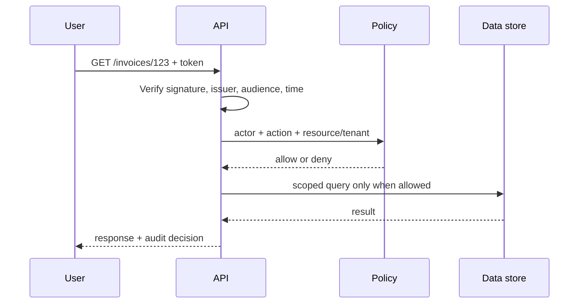
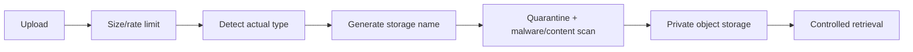
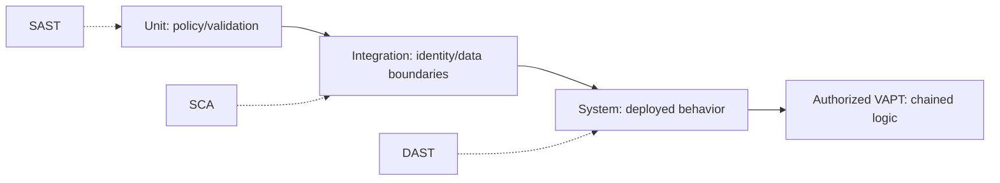
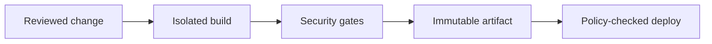

# Intermediate: identity, authorization, testing, and delivery

## 1. Authentication is not authorization

- **Authentication:** who are you?
- **Authorization:** may you perform this action on this object now?

A valid login does not permit every action.



### Object-level authorization

```ts
type Actor = { id: string; tenantId: string; roles: string[] };
type Invoice = { id: string; tenantId: string; ownerId: string };

function canReadInvoice(actor: Actor, invoice: Invoice): boolean {
  if (actor.tenantId !== invoice.tenantId) return false;
  return actor.roles.includes('billing-admin') || actor.id === invoice.ownerId;
}
```

Call the policy on every access path: list, detail, export, update, delete, bulk, background jobs, and administrative tools. The repository's runnable `canReadResource` and tests demonstrate the same principle.

## 2. Token validation

Decoding a JWT is not verification. A resource server must use a maintained library to verify at least:

- allowed algorithm and cryptographic signature;
- trusted issuer and intended audience;
- expiry and not-before times with bounded clock tolerance;
- key selection/rotation behavior;
- application-specific scopes/roles after identity verification.

```ts
// Illustrative library-shaped API; do not implement JWT crypto yourself.
const claims = await verifier.verify(token, {
  issuer: 'https://identity.example/',
  audience: 'orders-api',
  algorithms: ['RS256'],
});

if (!claims.scope.includes('orders:read')) throw new ForbiddenError();
```

Never choose an algorithm because the untrusted token asked for it.

## 3. Sessions and CSRF

For cookie-based sessions, use opaque unpredictable session identifiers, rotate on login/privilege change, expire idle/absolute sessions, invalidate logout, and protect state-changing requests against CSRF. `SameSite` helps but is not the only control for every architecture.

```ts
response.setHeader('Set-Cookie', [
  `session=${sessionId}; Path=/; HttpOnly; Secure; SameSite=Lax; Max-Age=1800`,
]);
```

Do not put session identifiers in URLs; URLs leak into history, logs, analytics, and referrers.

## 4. File upload design

Treat filename, declared content type, bytes, metadata, and parsers as hostile.



Store outside the web root, generate storage names, prevent path traversal, scan before release, apply decompression limits, and serve downloads with safe content disposition/type. Avoid risky parsing when business value does not require it.

## 5. SSRF and outbound requests

An application that fetches a user-provided URL can become a bridge to internal services or cloud metadata.

```ts
const allowedOrigins = new Set(['https://images.example.com']);

function validateRemoteUrl(raw: string): URL {
  const parsed = new URL(raw);
  if (!allowedOrigins.has(parsed.origin)) throw new Error('origin_not_allowed');
  if (parsed.username || parsed.password) throw new Error('userinfo_not_allowed');
  return parsed;
}
```

Production SSRF defense also requires controlled DNS/redirect behavior, egress network policy, metadata protection, protocol restrictions, time/size limits, and careful IP-range handling. URL string checks alone are insufficient.

## 6. Security testing layers



- Unit-test allow and deny outcomes.
- Integration-test tokens, proxy trust, queries, queues, and third parties.
- DAST-test the real deployed headers, routes, sessions, and errors.
- Use authorized human testing for business logic and attack chains.

See [SAST, DAST, and VAPT](../sast-dast-vapt.md).

## 7. CI/CD and supply chain

The repository's workflow installs locked dependencies, type-checks, tests, audits, runs CodeQL, builds the container, and emits an SBOM.



Secure the pipeline itself: minimize workflow permissions, pin dependencies/actions, protect branches/environments, avoid secrets in untrusted pull-request jobs, and prefer short-lived federated deployment identity.

## Intermediate exercise

Extend `canReadResource` with a `tenantId` on both actor and resource. Deny cross-tenant access before evaluating role or ownership. Add tests proving that a tenant administrator cannot cross the tenant boundary.

## Intermediate checklist

- Every token/session is fully verified, rotated, expired, and revoked appropriately.
- Authorization includes actor, action, object, tenant, and relevant context.
- Uploads and outbound requests cross explicit security boundaries.
- Tests cover forbidden cases and deployed behavior.
- CI permissions and artifacts follow least privilege and provenance.
