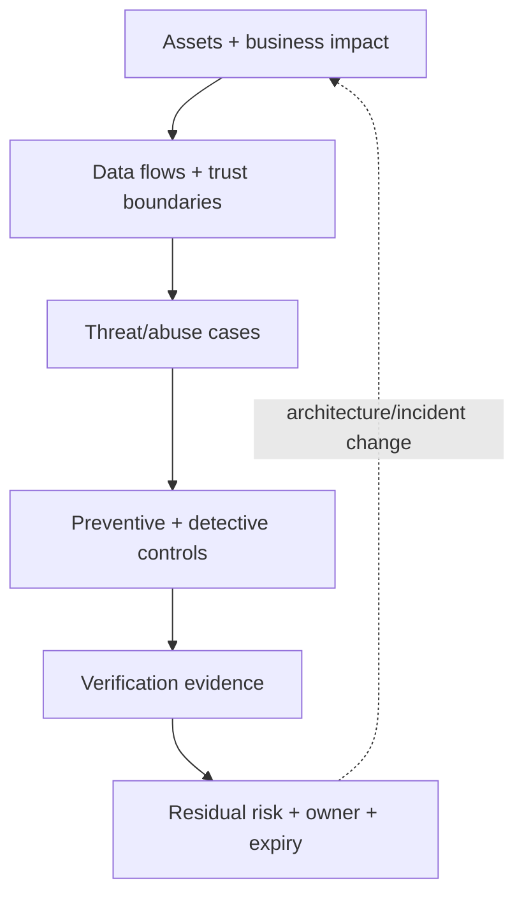
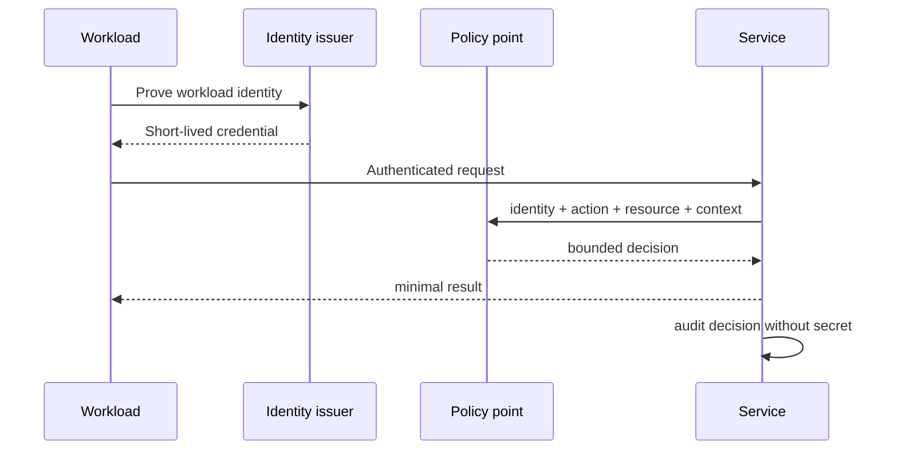

# Advanced: architecture, resilience, and continuous assurance

Advanced AppSec is less about collecting controls and more about preserving security properties across distributed systems, organizational boundaries, and failure states.

## 1. Turn invariants into controls and evidence

An invariant is a property that must always hold.

> A tenant must never read, change, infer, or influence another tenant's private data.

Map it across the system:

| Layer | Prevent | Detect/prove |
|---|---|---|
| edge | authenticated tenant context; header stripping | request/identity correlation |
| API | centralized object/action policy | allow/deny audit event |
| database | tenant-scoped query/RLS | query audit and isolation tests |
| cache | tenant included in key/namespace | cross-tenant cache regression test |
| queue | signed/scoped job context | producer/consumer trace |
| export | re-authorization and limits | export audit and anomaly alert |

This avoids the classic failure where the API is tenant-aware but a cache key or background worker is not.

## 2. Threat-led architecture



Model identity, administrative paths, CI/CD, telemetry, recovery, and third parties—not only public HTTP endpoints. Revisit the model when data flow or trust changes.

## 3. Distributed-system abuse and resilience

Timeouts, retries, queues, caches, and concurrency affect security.

### Idempotency and replay

```ts
interface StoredResult { requestHash: string; status: number; body: unknown }

async function executeOnce(
  actorId: string,
  idempotencyKey: string,
  requestHash: string,
): Promise<StoredResult> {
  const key = `${actorId}:${idempotencyKey}`;
  const existing = await resultStore.get(key);
  if (existing) {
    if (existing.requestHash !== requestHash) throw new Error('key_reused');
    return existing;
  }

  // Production code needs an atomic insert/transaction to close the race.
  return performAndStoreAtomically(key, requestHash);
}
```

Bind idempotency keys to authenticated identity and request content, expire them deliberately, and use atomic storage. Otherwise a key can replay or confuse a different operation.

### Bounded behavior

- Set connection, header, body, total request, and dependency timeouts.
- Retry only safe/idempotent operations, with exponential backoff and jitter.
- Bound concurrency, queue depth, response size, decompression, and pagination.
- Use circuit breaking/load shedding so one dependency cannot consume everything.
- Avoid detailed health endpoints that reveal internals publicly.

## 4. Zero trust as engineering behavior

Zero trust does not mean adding authentication once. Each request uses verified identity, device/workload context where appropriate, least privilege, explicit policy, encrypted transport, and continuous evidence.



Network location is useful context, not sufficient identity.

## 5. Software supply-chain assurance

Move beyond “scan dependencies”:

- review and lock direct/transitive dependencies;
- isolate builds from unnecessary secrets/network access;
- generate SBOM and build provenance;
- sign immutable artifacts and verify before deployment;
- protect source branches, runners, registries, environments, and release roles;
- define an emergency rebuild/revocation process.

An SBOM answers “what is inside?” It does not prove the contents are trustworthy, reachable, configured safely, or unmodified.

## 6. Detection engineering for applications

Start with an abuse case, identify required signals, create a detection hypothesis, test with safe simulations, and tune with feedback.

```ts
type AuthorizationEvent = {
  timestamp: string;
  requestId: string;
  actorId: string;
  tenantId: string;
  action: string;
  resourceType: string;
  decision: 'allow' | 'deny';
  reasonCode: string;
};
```

Do not log raw tokens, sensitive resource values, or unrestricted request bodies. Useful detections include high-rate object enumeration, repeated cross-tenant denials, unusual privileged exports, and a new identity followed by sensitive changes.

## 7. Vulnerability management by risk

Prioritize using asset criticality, internet exposure, reachability, exploit maturity, privileges required, data impact, compensating controls, and evidence—not scanner score alone. Track owner and remediation SLA. Exceptions require rationale, controls, expiry, and review.

Root-cause questions:

1. Which assumption failed?
2. Where else is the pattern present?
3. Which earlier lifecycle gate should prevent recurrence?
4. Which regression test proves closure?
5. Which telemetry detects past/future exploitation?

## 8. Security metrics that resist gaming

Prefer outcomes and feedback speed:

- time from introduction/detection to validated remediation by risk;
- percentage of critical flows with current threat models and negative tests;
- percentage of production artifacts verified against provenance;
- exception age and expired exceptions;
- mean time to detect/contain exercised abuse scenarios;
- recurrence rate of root-cause classes.

Raw finding counts can rise when visibility improves and fall when scanning breaks, so they are not a standalone maturity measure.

## Advanced capstone

Design a multi-tenant document API. Produce:

1. data-flow and trust-boundary diagram;
2. five abuse cases including cross-tenant cache and asynchronous-job paths;
3. centralized authorization function with negative tests;
4. safe upload and download design;
5. CI gates, SBOM/provenance policy, and deployment identity design;
6. three detection rules and an incident tabletop;
7. residual-risk register with owners and expiry dates.

The capstone is complete only when another person can trace every major security claim to code, configuration, a test, or operational evidence.
