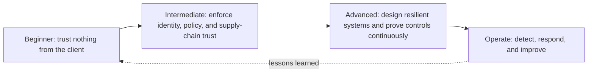

# Application security course: beginner to advanced

This course teaches how to build and defend applications, not how to attack systems without permission. Run exercises only in this repository's local lab or another explicitly authorized environment.

## Learning map



| Level | Main question | You will build/verify |
|---|---|---|
| [Beginner](01-beginner.md) | How do common bugs become vulnerabilities? | validation, safe output, secret hygiene, secure headers |
| [Intermediate](02-intermediate.md) | How do we protect users, objects, and delivery? | authentication, authorization, sessions, SAST/SCA/DAST, CI gates |
| [Advanced](03-advanced.md) | How do we manage complex trust and failure? | threat-led architecture, SSRF controls, tenant isolation, supply-chain provenance, detection |

## Study method

For each topic:

1. Explain the asset and attacker goal in one sentence.
2. Draw the data flow and mark trust boundaries.
3. Read the unsafe example and identify the broken assumption.
4. Implement the safe pattern and its negative test.
5. Verify the deployed behavior, not only the source code.
6. Record residual risk and operational detection.

## Local practice

```powershell
cd labs/reverse-proxy/api
npm ci --ignore-scripts
npm run check
npm test
npm run audit:prod
npm run build
```

The runnable examples are in `labs/reverse-proxy/api/src/security.ts`; their regression tests are in `labs/reverse-proxy/api/test/security.test.ts`.

## Completion standard

You are ready to move beyond a level when you can:

- explain the weakness without naming only a scanner rule;
- show the data/control flow that makes exploitation possible;
- fix the root cause rather than one payload;
- write a negative test proving unauthorized behavior fails;
- name the logging/detection evidence without exposing secrets.
