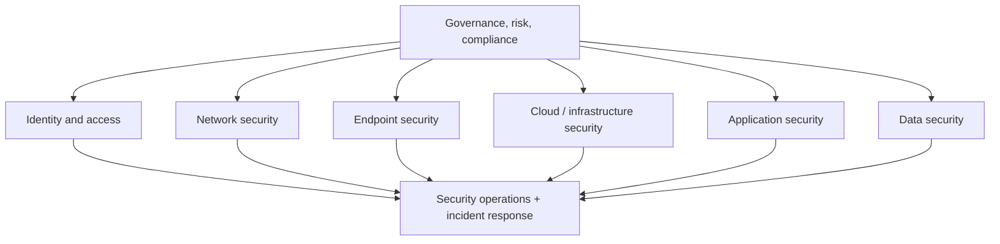
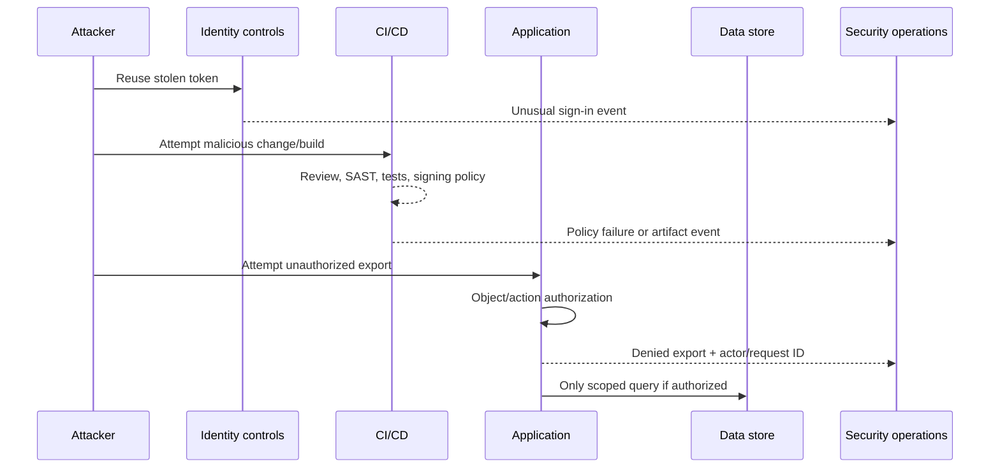

# How AppSec fits into cybersecurity

Cybersecurity protects the whole digital organization. Application security focuses on software behavior and its delivery chain. They overlap, but neither contains all of the other.

## Plain-language picture

Think of a bank:

- **Physical/network security** controls roads, doors, guards, and which rooms connect.
- **Identity security** verifies employees/customers and decides which rooms/actions each may use.
- **Endpoint security** protects staff laptops and servers.
- **Cloud/infrastructure security** configures the building, vault, cameras, and utilities safely.
- **AppSec** ensures the banking instructions cannot transfer another customer's money even when a logged-in user changes a request.
- **Data security** classifies, encrypts, minimizes, backs up, and audits money/customer records.
- **Security operations** watches alarms, investigates activity, and coordinates incidents.

## One attack, many disciplines

Scenario: a phished developer token is used to change an API and steal customer exports.

Defense requires multiple teams:

- Identity: phishing-resistant MFA, short-lived tokens, conditional access.
- Source/CI: protected branches, review, least-privilege workflows, signed artifacts.
- AppSec: authorization, validation, security tests, threat modeling.
- Data: scoped access, encryption, export controls, audit trails.
- SOC/IR: correlated detections, containment, evidence, recovery.

## End-to-end study order

1. Networking: understand paths, protocols, segmentation, and evidence.
2. Operating systems/endpoints: processes, permissions, patching, and telemetry.
3. Identity: authentication, sessions, authorization, federation, and secrets.
4. Secure engineering/AppSec: threat modeling, coding, testing, supply chain.
5. Cloud/infrastructure: least privilege, network policy, workload identity, IaC.
6. Detection and incident response: logs, use cases, triage, containment, lessons.
7. Governance and risk: asset ownership, policies, exceptions, third parties, metrics.

Practice only in owned labs or with explicit written authorization.
