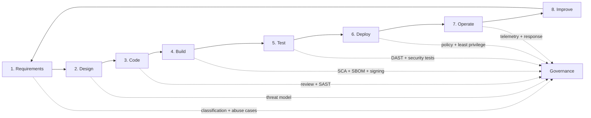
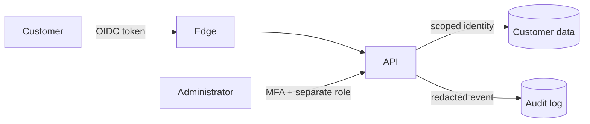
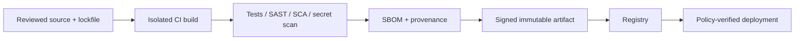
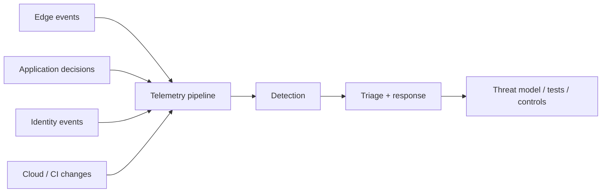

# End-to-end application security

Application security is a continuous engineering system: understand what matters, design controls, build safely, verify them, operate with evidence, and learn from failures.

For working TypeScript controls and CI gates, continue with [security automation](security-automation.md). For the wider defensive context, see [how AppSec fits into cybersecurity](cybersecurity-map.md).

## The whole lifecycle

## 1. Requirements: protect the right things

Identify users, critical business actions, sensitive data, compliance obligations, availability needs, and plausible abuse.

**Layman example:** Before building online banking, write down that “a customer must never transfer money from another customer's account,” not just “users can transfer money.” The first statement becomes a security acceptance test.

Deliverables: data classification, security stories, misuse/abuse cases, retention rules, RTO/RPO, and named risk owners.

## 2. Design: remove dangerous paths early

Draw components, data flows, identities, trust boundaries, entry points, and third parties. Apply least privilege, secure defaults, isolation, minimization, and failure-safe behavior. Use the [threat model](threat-model.md).

**Layman example:** A hotel master key should not be given to every cleaner. Likewise, one application credential should not have admin access to every database.

## 3. Code: make safe behavior easy

- Validate structure, type, length, range, encoding, and allowed values at the boundary.
- Authenticate identity and authorize every action/object server-side.
- Use parameterized database APIs and context-aware output encoding.
- Keep secrets out of source, errors, URLs, and logs.
- Set explicit timeouts, size limits, quotas, and safe error responses.
- Review security-sensitive changes and use SAST/secret detection.

**Layman example:** Validation is a guest list, not a bouncer judging appearances. Define exactly who and what is permitted; reject everything else consistently.

## 4. Build and supply chain: trust the recipe

Resolve dependencies from lockfiles, scan dependencies (SCA), produce an SBOM, isolate builds, minimize artifacts, scan images, and sign artifacts/provenance. Promote the same immutable artifact rather than rebuilding per environment.

**Layman example:** A sealed medicine bottle includes ingredients, batch identity, and tamper evidence. An artifact needs the software equivalents: SBOM, provenance, digest, and signature.

## 5. Test: prove controls at several layers

Use unit tests for policies and validators, integration tests for boundaries, DAST for deployed behavior, resilience tests for dependency failure, and authorized VAPT for human-led attack paths. See [SAST, DAST, and VAPT](sast-dast-vapt.md).

Test both the happy path and “who must not be allowed”:

| Scenario | Expected evidence |
|---|---|
| owner reads own invoice | `200`, correct tenant, audit event |
| owner reads another tenant's invoice | `403` or non-enumerating `404`, denial event |
| expired token | `401`, no backend data access |
| oversized body | edge rejects before application processing |
| database timeout | bounded failure, no retry storm, useful trace |

## 6. Deploy: preserve the security assumptions

Separate environments and duties, use short-lived deployment identities, policy-check infrastructure, inject secrets at runtime, encrypt traffic, restrict ingress/egress, and support safe rollback. Production changes must be traceable to reviewed source and an immutable artifact.

**Layman example:** Passing a vehicle safety inspection is pointless if someone removes the brakes during delivery. Deployment controls preserve what was tested.

## 7. Operate: observe behavior, not secrets

Collect structured logs, metrics, traces, audit decisions, identity events, and infrastructure changes. Redact credentials and sensitive values. Alert on meaningful patterns such as repeated authorization denials followed by success, unusual exports, or new privileged identities.

Patch against risk and reachability, rotate exposed secrets, test recovery, and follow the [incident-response runbook](../operations/incident-response.md).

## 8. Improve: close the feedback loop

Every finding should produce more than a ticket. Ask why the weakness was possible, where else the pattern exists, which earlier control could prevent it, what regression test proves the fix, and what telemetry would detect exploitation.

## End-to-end definition of done

- Security requirements and abuse cases are testable.
- Architecture, data flows, identities, and trust boundaries are current.
- High risks have preventive and detective controls with owners.
- Code and dependencies pass proportional automated and human review.
- The deployed system passes negative authorization and runtime tests.
- Artifacts are traceable, immutable, scanned, and verified at deployment.
- Logs support investigation without leaking secrets.
- Recovery and incident procedures have been exercised.
- Findings receive root-cause fixes, regression tests, and verified closure.
