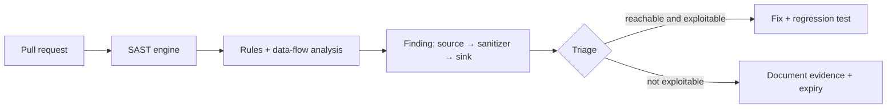
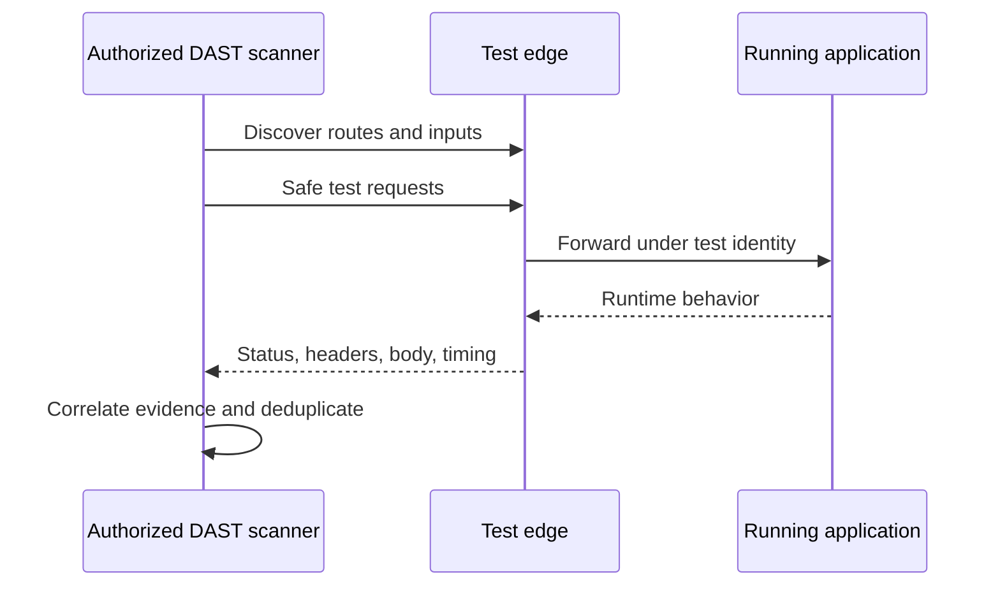
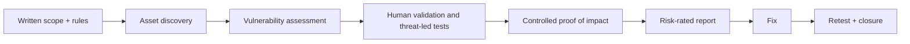
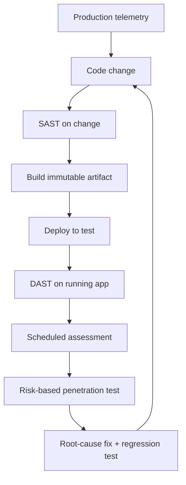

# SAST, DAST, and VAPT explained

These approaches answer different questions. None replaces secure design, code review, dependency scanning, or runtime monitoring.

## The simple analogy: inspecting a house

Imagine you want to know whether a house is safe:

- **SAST** is reviewing the blueprint and inspecting wiring before the house opens. You can point to the exact faulty wire, but you may flag wiring that is never connected.
- **DAST** is testing the finished house from outside: try the doors, windows, alarms, and water pressure. It sees what an outsider can actually reach, but may not show which wire inside caused a failure.
- **Vulnerability assessment** is a broad, repeatable inspection that lists known weaknesses: weak locks, an old alarm model, missing smoke detectors.
- **Penetration testing** is an authorized expert safely proving whether weaknesses can be chained to reach something valuable.
- **VAPT** commonly combines vulnerability assessment and penetration testing: find broadly, then validate deeply.

## Side-by-side comparison

| Property | SAST | DAST | Vulnerability assessment | Penetration test |
|---|---|---|---|---|
| Examines | source/bytecode without running app | running application from outside | hosts, apps, cloud, dependencies/config | agreed targets and attack paths |
| Knowledge | white/gray box | usually black/gray box | authenticated or unauthenticated scanning | black, gray, or white box |
| Best time | editor, pull request, CI | integration/staging; controlled production | scheduled and after change | risk-based, before release/periodically |
| Finds well | unsafe code flows, injection sinks, hard-coded secrets | runtime headers, auth/session behavior, exposed inputs | known CVEs, missing patches, misconfiguration | business logic, chained flaws, real impact |
| Weakness | false positives; lacks runtime context | limited code coverage; weaker root cause | breadth over proof; scanner noise | point-in-time; skill/scope dependent |
| Output | file/line/data flow | endpoint/request/response | asset/finding inventory | validated narrative, evidence, impact |

## SAST: static application security testing

SAST analyzes code without exercising the deployed service. A rule or data-flow engine follows untrusted input toward dangerous operations.

**Plain example:** A search term enters an API and is joined directly into a SQL string. SAST can trace the request value to the database call and identify the exact line. The fix is a parameterized query, plus a test that proves special characters remain data rather than instructions.

Use SAST early because developers still have context and fixes are inexpensive. Tune rules to the framework, block only high-confidence/high-impact findings, and track suppressions with an owner and review date.

SAST does **not** prove a deployed endpoint is reachable, configured correctly, or authorization-safe.

## DAST: dynamic application security testing

DAST sends requests to a running application and analyzes responses, timing, state changes, and out-of-band callbacks.

**Plain example:** A security header exists in source configuration but is absent after a CDN rewrite. SAST may see the intended header; DAST sees the actual browser-facing response and reports the missing protection.

DAST needs a stable authorized environment, seeded test accounts/roles, API specifications, rate limits, and data cleanup. It can alter data or stress services, so agree scope, test windows, stop conditions, and contacts.

DAST does **not** guarantee full route/state coverage and usually cannot pinpoint the faulty line.

## VAPT: vulnerability assessment and penetration testing

VAPT is a service/process, not one scanner button.

**Plain example:** A scanner reports an outdated admin portal. The assessment records the exposure. During an authorized penetration test, the tester discovers that a normal user can reach an admin export through a logic flaw, safely proves access using synthetic records, stops at the agreed boundary, and documents the full chain and fix.

A professional engagement defines:

- written authorization, targets, exclusions, dates, source IPs, and contacts;
- permitted techniques and explicitly prohibited actions;
- test accounts/data, rate limits, stop conditions, and incident handling;
- evidence handling, severity method, reporting, retest, and deletion/retention;
- third-party/cloud constraints and legal/privacy requirements.

Never run VAPT against a system merely because it is reachable. Permission must be explicit.

## How they work together

Example defense loop:

1. SAST finds a possible authorization bypass in a controller.
2. A developer fixes the policy call and adds unit tests for owner/non-owner roles.
3. DAST verifies the deployed API returns `403` for the wrong user.
4. A penetration tester checks adjacent workflows and discovers the bulk-export route missed the same policy.
5. The team centralizes authorization, adds regression tests, updates the threat model, and monitors denied cross-tenant attempts.

## Common mistakes

- Calling a vulnerability scan a penetration test.
- Reporting tool severity without business context or validation.
- Scanning production without approval, throttling, or stop conditions.
- Treating “no findings” as proof of security.
- Fixing one payload instead of the root cause and missing sibling endpoints.
- Suppressing noisy findings forever instead of tuning rules and recording evidence.
