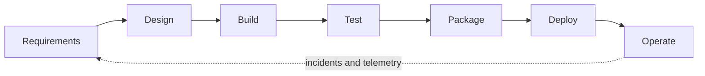

# Secure software development lifecycle

| Phase | Required security evidence |
|---|---|
| Requirements | data classification, abuse cases, security acceptance criteria |
| Design | architecture review, threat model, identity and trust-boundary decisions |
| Build | peer review, safe defaults, no embedded secrets, pinned dependencies |
| Test | unit/negative tests, SAST, SCA, secret scan, authorized DAST |
| Package | minimal image, SBOM, malware scan, signature and provenance |
| Deploy | protected environment, policy checks, least-privilege identity, rollback |
| Operate | logs/metrics/traces, alerts, vulnerability SLA, response exercises |

## CI quality gates

1. Formatting, linting, tests, and coverage threshold.
2. Secret detection with verified remediation (rotation, not just deletion).
3. Static analysis for supported languages.
4. Dependency and license policy against the lockfile/SBOM.
5. Infrastructure/container policy checks.
6. Artifact signing and provenance after trusted build.
7. Controlled promotion of the same immutable artifact.

Scanner findings are leads, not proof. Record reachability, exploitability, asset sensitivity, existing controls, and remediation evidence. Never suppress a finding without owner, reason, and review date.

## Secure design checklist

- Identity is explicit for users and workloads.
- Authorization occurs server-side for every object/action.
- Inputs are parsed once against a strict schema and outputs are contextually encoded.
- Secrets come from a managed store and are short-lived where possible.
- Timeouts, retries, size limits, quotas, and backpressure are bounded.
- Sensitive values are excluded or redacted from errors and telemetry.
- Administrative paths use separate strong controls.
- Dependencies, images, actions, and toolchains are pinned and updateable.
- Backups and recovery are tested.
