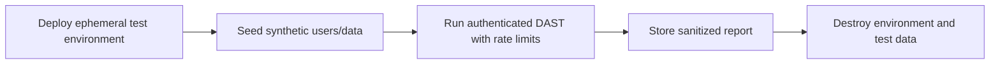

# Security automation: code to production

Automation makes the secure path repeatable. It does not transfer accountability to a scanner: people still define risk, validate findings, approve exceptions, and test business logic.

## Pipeline in this repository

```mermaid
flowchart LR
    PR["Push / pull request"] --> CI["Locked npm install"]
    CI --> TC["Strict type-check"]
    TC --> UT["Security unit tests"]
    UT --> SCA["Dependency audit"]
    SCA --> SAST["CodeQL SAST"]
    SAST --> B["Compile + container build"]
    B --> SB["CycloneDX SBOM"]
    SB --> A["Reviewable artifacts/results"]
    DEP["Dependabot"] -. "update PRs" .-> PR
```



The workflow lives in `.github/workflows/security.yml`. It runs on pull requests, pushes to `main`, a weekly schedule, and manual dispatch. Dependabot separately proposes npm, Docker, and GitHub Actions updates.

## What each gate proves

| Gate | Protects against | Does not prove |
|---|---|---|
| locked `npm ci` | unreviewed dependency drift | dependency is vulnerability-free |
| strict TypeScript | many type/state mistakes | correct authorization or business logic |
| security unit tests | known policy and validation invariants | all runtime paths are covered |
| `npm audit` | known advisories in dependency graph | exploitability or unknown vulnerabilities |
| CodeQL | supported code/data-flow weakness patterns | running configuration is secure |
| container build | image is reproducible enough to build | base image has no CVEs |
| SBOM | inventory for response and policy | components are safe or correctly configured |

## Code examples in the lab

`src/security.ts` demonstrates three reusable ideas:

1. **Allow-list validation:** request IDs accept only a small character set and maximum length, preventing control characters from forging log lines.
2. **Object-level authorization:** a reader can access a private record only when they own it; admins are an explicit separate role.
3. **Log redaction:** common bearer tokens and sensitive query values are replaced before telemetry.

`test/security.test.ts` tests both permitted and forbidden behavior. The negative authorization case is especially important: a successful owner request alone does not prove another user will be denied.

## Local commands

```powershell
cd labs/reverse-proxy/api
npm ci --ignore-scripts
npm run check
npm test
npm run audit:prod
npm run build
npm run sbom
```

The repository-level validation runs type checks and tests:

```powershell
powershell -NoProfile -ExecutionPolicy Bypass -File ./scripts/validate.ps1
```

## Adding DAST safely

DAST needs a running target and can modify data. Add it as a separate authorized staging job, not an uncontrolled production scan:



Before enabling a DAST tool, define the target allow-list, test accounts, permitted methods, maximum request rate, scan timeout, stop contact, data cleanup, and finding threshold. Keep the intentionally safe lab free of exploitable training vulnerabilities.

## Handling failures and exceptions

1. Reproduce and validate the finding.
2. Determine reachability, affected asset/data, exploitability, and business impact.
3. Fix the root cause and search for sibling instances.
4. Add a regression test and rerun all gates.
5. If risk must be accepted, record owner, evidence, compensating controls, expiry, and review date.

Do not “make CI green” by silently disabling a rule or ignoring an audit result.
