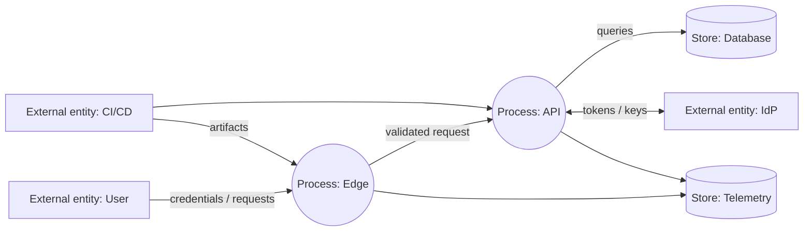

# Threat model

## Scope

The modeled system is the architecture in `docs/architecture`: internet client, edge proxy, API, identity provider, database, telemetry, and CI/CD. Assets include credentials, tokens, personal/business data, signing keys, source code, artifacts, audit events, and service availability.

## Data-flow view

Trust boundaries exist at public-to-edge, edge-to-application, application-to-data/identity, telemetry ingestion, and delivery-to-runtime.

## STRIDE register

| ID | Threat | Boundary/asset | Example control | Verification |
|---|---|---|---|---|
| T1 | Spoofing | user/workload identity | phishing-resistant MFA, OIDC validation, mTLS workload identity | invalid issuer/audience/cert tests |
| T2 | Tampering | request/artifact | TLS, schema validation, signed provenance, immutable digest | signature and malformed-input tests |
| T3 | Repudiation | privileged action | append-resistant audit events, synchronized time, actor/request IDs | reconstruct tabletop timeline |
| T4 | Information disclosure | tokens/data/logs | least data, encryption, redaction, cache policy | secret scan and log review |
| T5 | Denial of service | edge/API/database | quotas, body/time limits, bounded queues, circuit breakers | authorized load/failure test |
| T6 | Elevation of privilege | authorization | deny by default, object-level checks, scoped service roles | horizontal/vertical access tests |
| T7 | SSRF | outbound network/metadata | URL allow-list, egress proxy, metadata protection | redirect/DNS-rebinding cases in test lab |
| T8 | Injection | interpreter/database | parameterized APIs, strict schemas, contextual encoding | fuzz and negative unit/integration tests |
| T9 | Supply-chain compromise | dependencies/build | lockfiles, SCA, SBOM, isolated build, signing | verify dependency and artifact policy |

## Abuse cases

- An anonymous client sends oversized or slow requests to exhaust workers.
- An authenticated user requests another user's object by changing an identifier.
- A compromised application attempts to reach cloud metadata or an arbitrary internet host.
- A malicious dependency exfiltrates a build secret.
- An attacker injects newlines or tokens into logs to conceal activity.

## Risk method

Score **likelihood (1–5) × impact (1–5)**. Treat 15–25 as critical/high, 8–14 as medium, and 1–7 as low, then adjust for exploitability and existing controls. Each accepted risk needs an owner, rationale, expiry/review date, and compensating controls.

## Definition of done

- Data flows and trust boundaries match the deployed design.
- Every high-risk threat has a preventive and detective control.
- Controls have automated or repeatable verification.
- Residual risks are owned and time-bound.
- The model is reviewed for every material architecture or identity change.
