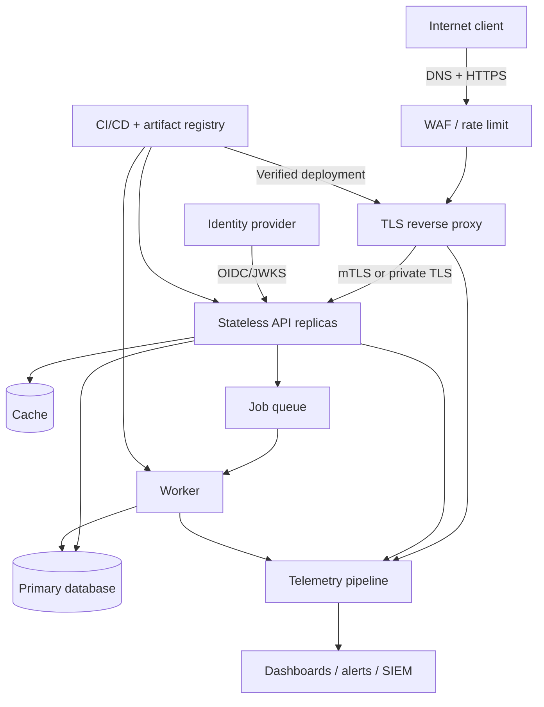
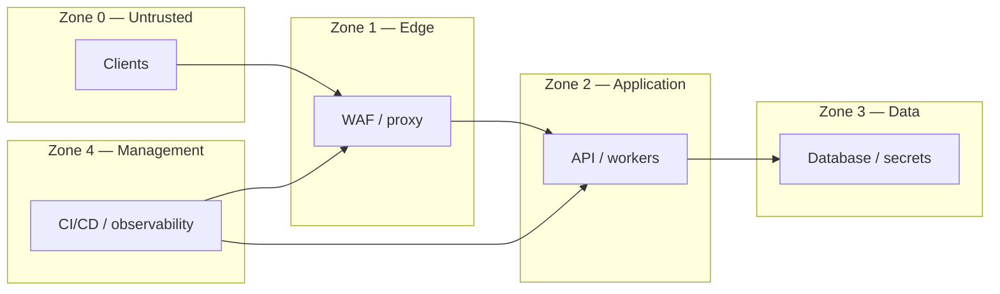

# System architecture (HLD)

The reference architecture represents a public API delivered through an edge proxy, backed by private application and data tiers, with centralized telemetry and a controlled delivery path.

## Trust zones

Every arrow is an allow-listed flow, not implied reachability. Default deny ingress and egress, authenticate service identity, encrypt across trust boundaries, and record policy decisions.

## Quality attributes

| Attribute | Target design response |
|---|---|
| Security | least privilege, strong identity, defense in depth, immutable artifacts |
| Availability | stateless replicas, bounded retries, health checks, graceful degradation |
| Performance | connection reuse, caching with explicit policy, asynchronous work |
| Operability | correlation IDs, structured logs, RED metrics, distributed traces |
| Recoverability | tested backups, documented RTO/RPO, reproducible infrastructure |

## Key decisions

1. Terminate public TLS at a hardened edge; use authenticated encryption for sensitive internal hops.
2. Keep APIs stateless and externalize durable state.
3. Never expose data stores directly to the public network.
4. Use short-lived workload/user identity and centralized policy where practical.
5. Deploy only scanned, signed, pinned artifacts through an auditable pipeline.

See the [low-level design](lld.md), [threat model](../appsec/threat-model.md), and [operations runbook](../operations/incident-response.md).
