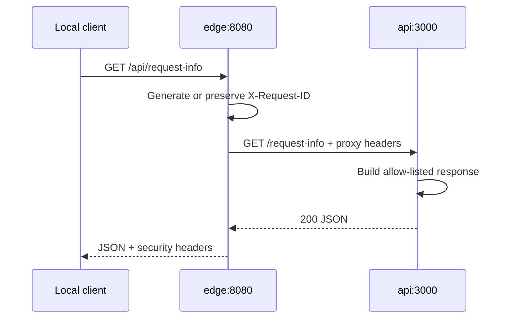
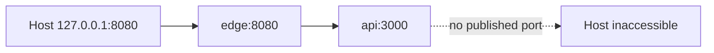

# Low-level design (LLD)

## Runnable lab components

| Component | Responsibility | Interface | Security behavior |
|---|---|---|---|
| `edge` | reverse proxy and security headers | host `127.0.0.1:8080`; container `:8080` | hides server version, sets request ID, constrains methods |
| `api` | strict TypeScript health and request-inspection endpoints | private container network `:3000` | non-root, read-only filesystem, no host port |
| `lab_net` | isolated service communication | Docker bridge | internal API discovery; only edge is published |

## Container and request flow

## Endpoints

### `GET /health`

- Purpose: edge and upstream liveness.
- Success: `200`, JSON health document.
- Contains no dependency details or secrets.

### `GET /api/request-info`

- Purpose: demonstrate the proxy boundary.
- Success: `200`, JSON containing method, path, request ID, and proxy-observed address/protocol.
- The API returns only allow-listed headers; it never reflects arbitrary input.

### Other routes and methods

- Unknown path: `404`.
- Unsupported method: `405`.
- Request body at edge: capped at 16 KiB for this read-only demonstration.

## Runtime constraints

- Containers run as unprivileged users.
- Root filesystems are read-only; `/tmp` uses bounded `tmpfs`.
- Linux capabilities are dropped and privilege escalation is disabled.
- Images are pinned to stable version lines. Production systems should pin immutable digests.
- TypeScript is compiled in a separate container stage; compiler dependencies are absent from the runtime image.
- Health checks determine dependency readiness.

## Production delta

The lab uses plain HTTP on one local Docker bridge for visibility and simplicity. A production version must add managed certificates, internal TLS/mTLS based on risk, real authentication/authorization, secret management, WAF/rate controls, durable telemetry, redundancy, backups, and deployment provenance.

## Failure behavior

| Failure | Expected result | Evidence |
|---|---|---|
| API unhealthy | edge returns `502`/`504` | edge + API logs sharing request context |
| invalid route | `404` | edge access event |
| unsupported method | `405` | client response and edge event |
| oversized request | `413` | edge event, no API processing |

## Verification

Run `powershell -NoProfile -ExecutionPolicy Bypass -File ./scripts/validate.ps1` for static checks on Windows, then follow [the lab verification steps](../../labs/reverse-proxy/README.md).
