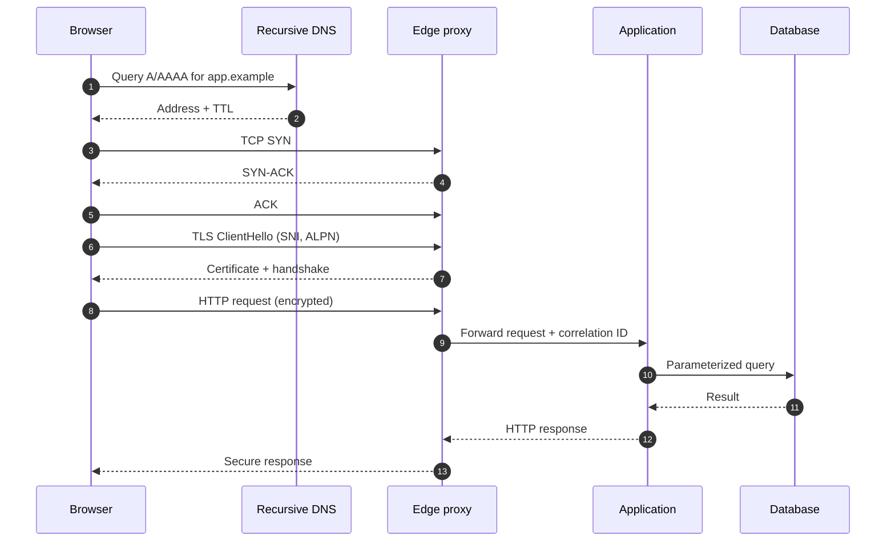

# DNS → TCP → TLS → HTTP request lifecycle

This sequence is the core mental model for debugging a web request.

## Step-by-step questions

1. **URL parsing:** What are the scheme, authority, port, path, and query?
2. **Name resolution:** Which resolver answered, what record/TTL was returned, and was it cached?
3. **Routing:** Which interface, source address, gateway, and path will be selected?
4. **Transport:** Did a handshake complete? Is loss or a middlebox causing retries?
5. **TLS:** Does the certificate chain to a trusted root, match the name, and remain valid at the current time?
6. **HTTP:** Which method, host, headers, cookies, body, and protocol version are used?
7. **Proxy:** Which headers are accepted, stripped, or generated? Can the client spoof identity-bearing headers?
8. **Application:** Where are authentication, authorization, validation, and rate limits enforced?
9. **Response:** Are caching and browser security headers appropriate for the content?

## Common symptoms

| Symptom | Likely layer | First evidence |
|---|---|---|
| Name not found | DNS | Resolver response and search suffix |
| Timeout | routing/firewall/service | Route, SYN retries, listener |
| Connection refused | transport/service | RST and listening sockets |
| Certificate warning | TLS/PKI | SAN, chain, validity, system time |
| 502/504 | proxy/upstream | Edge and upstream logs with request ID |
| 401 vs 403 | application security | Authentication and policy decision |

## Safe capture practice

Packet captures can contain credentials, cookies, personal data, internal addresses, and DNS history. Capture only in an authorized lab, constrain by interface/host/port, keep duration short, and sanitize before sharing. Do not commit raw captures to this repository.
