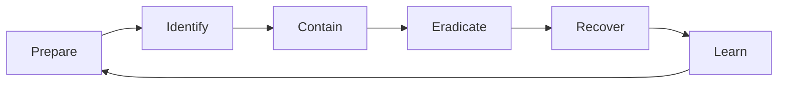

# Incident-response runbook

## Lifecycle

Safety, legal obligations, evidence integrity, and clear ownership take priority over speed.

## First 30 minutes

1. Start an incident record; assign incident commander, operations lead, communications lead, and scribe.
2. Record detection source, time, affected service, initial indicators, and confidence.
3. Set severity from impact and urgency; define the next update time.
4. Preserve volatile evidence and relevant logs with access controls and hashes where appropriate.
5. Contain with the smallest reversible action: revoke a token, isolate a workload, block a precise indicator, or shift traffic.
6. Establish trusted communications if normal channels may be compromised.

Do not destroy evidence, power off systems reflexively, share sensitive indicators publicly, or make untracked production changes.

## Technical checklist

- Correlate edge, application, identity, database, cloud/control-plane, and CI/CD events by time and request/actor ID.
- Determine initial access, execution, persistence, privilege, lateral movement, collection, and exfiltration evidence.
- Rotate exposed secrets only after identifying where replacements could also be captured.
- Remove persistence and root cause; rebuild from trusted artifacts when integrity is uncertain.
- Validate monitoring, access control, data integrity, and business function before restoring traffic.
- Increase monitoring temporarily and define rollback criteria.

## Communications template

> **Status:** Investigating / Contained / Monitoring / Resolved
>
> **Impact:** Known users, data, regions, and time window
>
> **Actions:** Completed containment and current work
>
> **Unknowns:** Explicit open questions
>
> **Next update:** Time and channel

## Post-incident review

Within a defined window, create a blameless timeline, contributing conditions, detection/response gaps, and corrective actions with owners and dates. Track actions to closure and update the threat model, tests, alerts, and runbooks.
